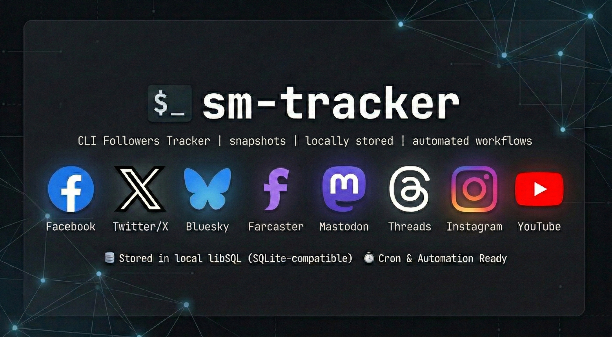

# Social Media Tracker (sm-tracker)



`sm-tracker` is a CLI that tracks follower and following counts across 🐦 Twitter/X, 🦋 Bluesky, 🛰️ Farcaster, 🐘 Mastodon, 🧵 Threads, 📘 Facebook, 📸 Instagram, and 📺 YouTube.

`sm-tracker` stores social-metric snapshots in libSQL (local SQLite-compatible by default), prints human-readable output by default, and supports JSON/CSV for scripts, cron jobs, and AI-agent automation.

## ✅ Requirements

- Python 3.12+
- `uv`
- API credentials in `.env`
- Runtime settings in `config.toml`

## ⚙️ Installation

### Local development

```bash
uv sync
uv run sm-tracker help
```

### Install as a CLI tool

```bash
uv pip install -e .
sm-tracker help
```

## 🚀 Quickstart

After `uv pip install -e .`, run:

1. Create credentials and app config via guided setup:

```bash
sm-tracker config
```

1. Track a snapshot:

```bash
sm-tracker track -p twitter -p bluesky
```

1. Show latest values with deltas:

```bash
sm-tracker show -p twitter -p bluesky
```

1. Inspect historical data:

```bash
sm-tracker history -p twitter --limit 10
```

## 🧭 Onboarding Guide

Use this flow for a clean checkout to first successful snapshot.

### 📦 1) Install dependencies

```bash
uv sync
```

### 🛠️ 2) Run guided setup

```bash
uv run sm-tracker config
```

The command will create or update:

- `.env` for API credentials and account identifiers
- `config.toml` for database path, log path, retention, and log level

### 🔑 3) Platform credential checklist

You can configure one or many platforms. Missing credentials skip only that platform.

#### Twitter/X

> **Note:** The Twitter/X API requires a paid Basic tier subscription or higher. The Free tier is not sufficient.

- `TWITTER_BEARER_TOKEN`
- `TWITTER_HANDLE`

#### Bluesky

- `BLUESKY_HANDLE`
- Optional: `BLUESKY_APP_PASSWORD`

#### Farcaster

- `FARCASTER_API_KEY`
- `FARCASTER_USERNAME`

Get API credentials from `https://warpcast.com/developer`.

#### Mastodon

- `MASTODON_ACCESS_TOKEN`
- `MASTODON_INSTANCE` (for example `mastodon.social`)

#### Threads

- `THREADS_ACCESS_TOKEN`
- `THREADS_USER_ID`
- Optional for OAuth flow: `THREADS_APP_ID`, `THREADS_APP_SECRET`, `THREADS_REDIRECT_URI`

Refresh Threads credentials via OAuth when needed:

```bash
uv run sm-tracker auth -p threads
```

#### Meta (Facebook & Instagram)

See the full [Credentials Setup Guide](docs/CREDENTIAL_SETUP_GUIDE.md) for step-by-step instructions.

To configure either platform easily, use the interactive auth flow to exchange short-lived tokens for long-lived ones automatically:

```bash
uv run sm-tracker auth -p facebook
# OR
uv run sm-tracker auth -p instagram
```

**Facebook:**

- `FACEBOOK_PAGE_ACCESS_TOKEN` (Generated by auth command)
- Optional: `FACEBOOK_ACCESS_TOKEN` + `FACEBOOK_ID`

**Instagram:**

- `LONG_LIVED_USER_TOKEN` (Generated by auth command)
- `INSTAGRAM_ACCOUNT_ID`

#### YouTube

- `YOUTUBE_API_KEY`
- `YOUTUBE_HANDLE` or `YOUTUBE_CHANNEL_ID`

### 📁 4) File locations

- Database path: from `config.toml` (`[paths.<profile>].db`)
- Logs directory: from `config.toml` (`[paths.<profile>].logs`)
- Log file name: `sm-tracker.log`

### 🧪 5) Common troubleshooting

- No platforms detected in `track`:
    - Run `sm-tracker config` and ensure required platform env vars are present.
- `show` says no snapshots yet:
    - Run `sm-tracker track` first.
- Token expiration warnings (Threads/Meta):
    - Run `sm-tracker auth -p threads`, `-p facebook`, or `-p instagram` to refresh and securely save new tokens to `.env`.
- Live tests failing during development:
    - If running `mise run test-real` locally, ensure credentials in your `.env` are completely uncommented. Variables defined in your terminal session can occasionally override `.env` values during tests.

## 🧰 Commands

- `track`: fetch counts from configured platforms and save a snapshot (`--json` / `--csv` for structured output)
- `show`: print latest snapshot with deltas from previous snapshot (`--json` / `--csv` supported)
- `history`: print history table (`Date | Platform | Followers | Following | Delta`) or structured output with `--json` / `--csv`
- `config`: guided setup and validation for `.env` and `config.toml`
- `auth`: run OAuth/Token exchange flows for supported platforms (`threads`, `facebook`, `instagram`)
- `help`: print CLI usage

## 🧱 Tech Stack

### Core

| Layer   | Technology | Notes                                                                              |
| ------- | ---------- | ---------------------------------------------------------------------------------- |
| CLI     | Typer      | Elegant command-line interfaces                                                    |
| Storage | libSQL     | SQLite-compatible, [tursodatabase/libsql](https://github.com/tursodatabase/libsql) |

### Platforms

| Platform  | Technology       | Notes                                                                           |
| --------- | ---------------- | ------------------------------------------------------------------------------- |
| Twitter   | Tweepy           | [tweepy/tweepy](https://github.com/tweepy/tweepy)                               |
| Bluesky   | atproto          | [bluesky-social/atproto](https://github.com/bluesky-social/atproto)             |
| Farcaster | Direct API       | Warpcast API (`api.warpcast.com`)                                               |
| Mastodon  | Mastodon.py      | [halcy/Mastodon.py](https://github.com/halcy/Mastodon.py)                       |
| Threads   | meta-threads-sdk | [MetaThreads/meta-threads-sdk](https://github.com/MetaThreads/meta-threads-sdk) |
| Meta      | Direct API       | Graph API for Facebook and Instagram tokens                                     |
| YouTube   | Direct API       | YouTube Data API v3                                                             |

**Python:** 3.12+ (required by meta-threads-sdk)

## 📝 Configuration

Configuration is split into two files per best practice:

| File          | Purpose                                        | Location                                          |
| ------------- | ---------------------------------------------- | ------------------------------------------------- |
| `.env`        | API keys, tokens, secrets, account identifiers | Project dir or loaded from process env            |
| `config.toml` | Paths, retention, log level, non-sensitive     | `~/.config/sm-tracker/config.toml` or project dir |

`.env` is never committed; `config.toml` may ship with defaults.

### Quick Links

- Credential template: [`.env.example`](.env.example)
- App config template: [`config.toml.example`](config.toml.example)
- Full credential setup guide: [`docs/CREDENTIAL_SETUP_GUIDE.md`](docs/CREDENTIAL_SETUP_GUIDE.md)
- Full config and env variable reference: [`docs/CONFIG_REFERENCE.md`](docs/CONFIG_REFERENCE.md)

## 📊 Example output

```text
twitter
  Followers: 132 (+10)
  Following: 178 (0)
```

```text
Date | Platform | Followers | Following | Delta
2026-02-25T10:30:00Z | twitter | 122 | 178 | N/A
2026-02-26T10:30:00Z | twitter | 132 | 178 | +10
```

## 💡 Notes

- Default output is plain text. Use `--json` or `--csv` on `track`, `show`, and `history` for structured output.
- Missing credentials for one platform do not stop other platforms from running.
- `show` and `history` print empty-state guidance if there is no stored data yet.

## 📄 License

MIT
